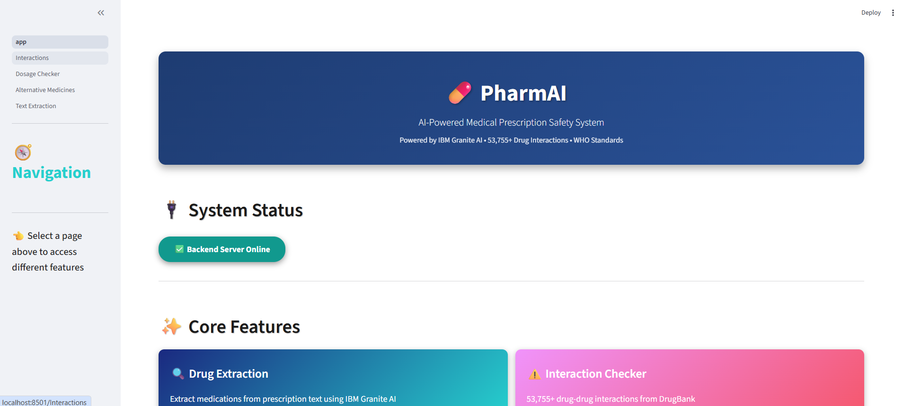

<div align="center">

# 💊 PharmAI
### AI-Powered Medical Prescription Safety System



[](https://www.python.org/downloads/)
[](https://fastapi.tiangolo.com/)
[](https://streamlit.io/)
[](https://huggingface.co/ibm-granite/granite-3.2-2b-instruct)

**Intelligent prescription validation platform combining AI, medical datasets, and clinical decision support**

[Features](#-features) • [Installation](#-installation) • [Quick Start](#-quick-start) • [API](#-api-endpoints) • [Contributing](#-contributing)

</div>

---

## 📋 Overview

PharmAI is an AI-powered prescription safety platform that validates medications, detects drug interactions, verifies dosages, and predicts clinical risks using IBM Granite AI and comprehensive medical databases.

---

## 🎯 Features

<table>
<tr>
<td width="50%">

### 🔍 AI Drug Extraction
- IBM Granite 3.2-2B AI model
- Extracts name, dose, frequency, route
- Normalizes drug names (DrugBank)
- Regex fallback for reliability

</td>
<td width="50%">

### ⚠️ Interaction Detection
- 53,755+ drug interactions
- Major/Moderate/Minor severity
- Real-time analysis
- Clinical recommendations

</td>
</tr>
<tr>
<td width="50%">

### 💊 Dosage Verification
- WHO ATC/DDD standards
- Age-specific validation
- Pediatric/Adult/Geriatric
- Safety alerts

</td>
<td width="50%">

### 🔄 Alternative Medicines
- Safer/cost-effective options
- ATC classification
- WHO Essential Medicines priority
- Regional database (194+ Indian meds)

</td>
</tr>
<tr>
<td width="50%">

### 📊 Risk Prediction
- 0-100 risk scoring
- Interaction (60%) + Dosage (30%) + Polypharmacy (10%)
- 5 risk levels: Safe → Dangerous
- Personalized by age/weight

</td>
<td width="50%">

### 🔊 Accessibility
- Speech-to-Text (Whisper)
- Text-to-Speech (Coqui TTS)
- Multi-modal input
- Inclusive design

</td>
</tr>
</table>

---

## 🏗️ Architecture

```
PharmAI/
├── backend/                     # FastAPI Backend
│   ├── main.py                 # API entry point
│   ├── routers/                # API endpoints
│   ├── services/               # Business logic (AI, interaction checker, etc.)
│   ├── models/                 # Pydantic schemas
│   ├── utils/                  # Utilities (normalizer, preprocessor)
│   └── data/
│       ├── raw/                # Source datasets
│       └── processed/          # Preprocessed data
│
├── frontend/                    # Streamlit UI
│   ├── app.py                  # Main dashboard
│   └── pages/                  # Multi-page app
│
├── .env.example                # Environment template
├── start_app.ps1               # Application launcher
└── README.md
```

---

## 📦 Installation

### Prerequisites
- Python 3.10+
- 8GB RAM (for AI models)
- Hugging Face account

### Setup

```bash
# Clone repository
git clone https://github.com/Supriya-gouda/PhramAI.git
cd PhramAI

# Install dependencies
pip install -r backend/requirements.txt

# Configure environment
cp .env.example .env
# Edit .env and add: HF_TOKEN=hf_your_token_here
```

**Get HF Token**: [huggingface.co/settings/tokens](https://huggingface.co/settings/tokens)  
**Accept License**: [IBM Granite Model](https://huggingface.co/ibm-granite/granite-3.2-2b-instruct)

### Prepare Data

```bash
cd backend/data
python generate_datasets.py      # Create sample datasets
python preprocess_datasets.py    # Process datasets
```

> **Note**: `db_drug_interactions.csv` (8MB) and `full database.xml` are excluded due to size/licensing.  
> For production, obtain DrugBank license and add these files to `backend/data/raw/`

---

## 🚀 Quick Start

### Launch Application

```powershell
.\start_app.ps1
```

This automated script:
- ✅ Verifies Python & dependencies
- ✅ Checks data files
- ✅ Starts backend (http://127.0.0.1:8000)
- ✅ Launches frontend (http://localhost:8501)

### Manual Start

**Terminal 1 - Backend:**
```bash
python -m uvicorn backend.main:app --host 127.0.0.1 --port 8000
```

**Terminal 2 - Frontend:**
```bash
cd frontend
streamlit run app.py
```

### Access Points
- **Frontend**: http://localhost:8501
- **API Docs**: http://localhost:8000/docs
- **Health**: http://localhost:8000/health

---

## 📖 Usage

### Extract & Analyze Prescriptions
1. Go to **Text Extraction** page
2. Enter prescription text and patient info (age, weight)
3. Click **Extract & Analyze**
4. View: medications, risk score, recommendations

### Check Drug Interactions
1. Navigate to **Interactions** page
2. Enter medications (one per line)
3. View interaction severity and recommendations

### Verify Dosage
1. Go to **Dosage Checker**
2. Enter patient info and medication details
3. Compare against WHO DDD standards

### Find Alternatives
1. Visit **Alternative Medicines**
2. Enter medication name and reason
3. View safer/cost-effective options

---

## 🔧 API Endpoints

### Extract Medications
```http
POST /extraction/extract
{
  "text": "Aspirin 100mg once daily",
  "patient_age": 45,
  "patient_weight_kg": 70
}
```

### Check Interactions
```http
POST /interactions/check
{
  "medications": ["Aspirin", "Warfarin"]
}
```

### Verify Dosage
```http
POST /dosage/verify
{
  "medication": "Aspirin",
  "prescribed_dose": 100,
  "dose_unit": "mg",
  "patient_age": 45
}
```

### Predict Risk
```http
POST /risk/predict
{
  "medications": [{"name": "Aspirin", "dose": 100, "unit": "mg"}],
  "patient_info": {"patient_age": 45, "patient_weight_kg": 70}
}
```

**Full API Docs**: http://localhost:8000/docs

---

## 📊 Datasets

| Dataset | Records | Purpose |
|---------|---------|---------|
| DrugBank Interactions* | 53,755+ | Drug interaction detection |
| DrugBank Vocabulary | 15,000+ | Drug name normalization |
| WHO ATC/DDD | 6,000+ | Dosage standards |
| Essential Medicines List | 500+ | Alternative recommendations |
| Indian Medicines | 194+ | Regional drug database |

**\*Note**: DrugBank interaction data requires separate license and is not included in repository.

---

## ⚠️ Disclaimer

**For educational and research purposes only**
- Not a substitute for professional medical advice
- Always consult licensed healthcare professionals
- Not FDA approved for clinical use

---

## 🤝 Contributing

Contributions welcome! Areas for improvement:
- Expand medical datasets
- Improve NLP accuracy
- Add multi-language support
- Enhance UI/UX
- Add test coverage

---

## 📄 License

MIT License - see [LICENSE](LICENSE) file for details

---

## 🙏 Acknowledgments

- **IBM Research** - Granite AI model
- **Hugging Face** - Model hosting
- **WHO** - Medical standards & datasets
- **DrugBank** - Pharmaceutical database
- **OpenAI** - Whisper STT
- **Coqui AI** - TTS engine

---

## 📧 Contact

**Developer**: Supriya Gouda  
**Repository**: [github.com/Supriya-gouda/PhramAI](https://github.com/Supriya-gouda/PhramAI)  
**Issues**: [Report a bug](https://github.com/Supriya-gouda/PhramAI/issues)

---

<div align="center">

**Built with ❤️ for safer prescriptions**

[](https://github.com/Supriya-gouda/PhramAI)
[](https://github.com/Supriya-gouda/PhramAI)

</div>
